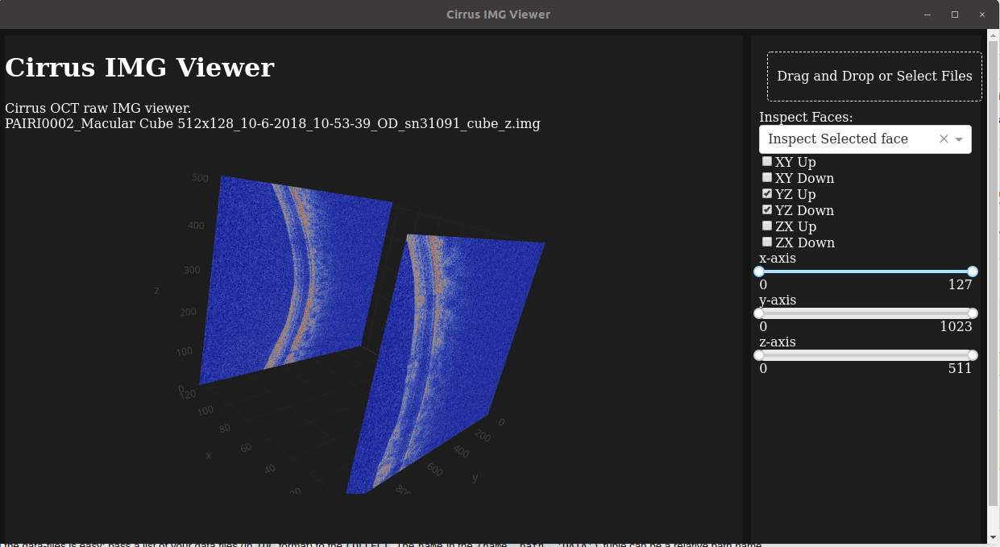

# Cirrus IMG Viwer

## Requirements
- dash
- numpy
- pyfladesk (only if using for desktop bundle)
- pyinstaller (only if using for desktop bundle)

## Usage
For development, simply:
```
$ python app.py
```

For build for desktop, you will need to edit the dependency path for ```app.spec``` for your environment for those *.js files, which will be ignored by the Pyinstaller, for a light-weight application, it would be the best to create a new environment for building this app only with the packages only needed.

With the updated ```app.spec``` file, you may run:
```
$ pyinstaller app.spec
```

On Linux, enabling UPX may help reducing the package size. To install it:
```
$ apt-get install -y upx
```

For cross-platform builds, it is recommand to use [docker-pyinstaller](https://github.com/cdrx/docker-pyinstaller). For windows build, needed external .dll can be found under "qt_assets".
```
$ docker pull cdrx/pyinstaller-windows
$ docker run -v "$(pwd):/src/" cdrx/pyinstaller-windows
```

## Screenshots


## Known issues
- The renderer is a bit slow. It is an issues with the ```dash``` library as well as there are six 3D cube rendering tasks. It is recommanded to use the ```Inspect Selected face``` instead of view all the faces.
- UPX is not avaliable for Windows builds.
- Error will occur with Pyinstaller for windows build when [PyQT5 >= 5.12.3](https://github.com/pyinstaller/pyinstaller/issues/4293)